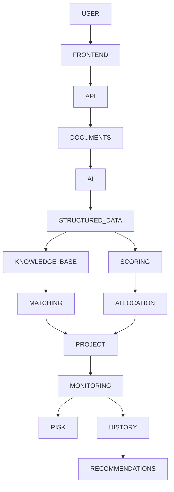

# KellyOS Architecture

KellyOS is a modular CSR decision-support platform. AI interprets documents; deterministic engines score, match, allocate, and detect risk. Humans make final decisions.

## System overview

## Frontend

- Next.js App Router with server components for data loading  
- Client components for charts, uploads, and interactive flows  
- Shared shells: sidebar, top search/notifications, breadcrumbs  
- Reusable: `ScoreCard`, `RecommendationCard`, `LifecycleTimeline`, chart wrappers  

## Backend

- Route handlers under `src/app/api/*`  
- Business logic in `src/services/*` (not in page components)  
- Zod validation at API boundaries  
- Audit logging for overrides and key actions  

## Database

**Firebase Firestore** via `firebase-admin`, with a local JSON document store fallback (`USE_DEMO_FIRESTORE=true`) for zero-credential demos.

Collections mirror domain models: `User`, `Company`, `Project`, `NGO`, `NGOMatch`, `ProjectScore`, `Milestone`, `Risk`, `Allocation`, `AuditLog`, `Notification`, …

Access layer: `src/lib/db.ts` (repository API used by pages and routes).

Config: `src/lib/firebase.ts`

## AI layer

| Provider | When |
|----------|------|
| `OpenAIProvider` | `OPENAI_API_KEY` present, `USE_DEMO_AI` not forced |
| `DemoAIProvider` | Default / demo / fallback on API failure |

Methods: `extractProject`, `extractNGO`, `explainRecommendation`, `summarizeReport`, `analyzeRiskNarrative`.

Outputs validated with Zod. Missing evidence → “Not enough evidence”, not invented facts.

## Scoring engine

`services/scoring/projectScoring.ts`

- Inputs: project signals, company profile, optional NGO history, weights  
- Outputs: five dimension scores + confidence + evidence + recommendation level  
- Reproducible for identical inputs  

## Matching engine

`services/matching/ngoMatching.ts`

- Expertise, geography, beneficiaries, execution, relevant experience, risk  
- Cold start: missing history reduces **confidence**, not automatic poor performance  
- Token/Jaccard similarity fallback when embeddings unavailable  

## Allocation engine

`services/allocation/allocationEngine.ts`

- Priority weight from score + efficiency + confidence  
- Caps at requested budget; respects total budget  
- Labeled **Recommended allocation** (not “correct” or guaranteed optimal)  
- Unit-testable; knapsack abstraction for future optimization  

## Risk engine

`services/risk/riskEngine.ts`

- Progress gap, overdue/delayed milestones, budget burn variance, missing reports  
- Deterministic levels + recommended actions  

## Document ingestion

`services/documents/extraction.ts`

Upload → validate MIME → store → extract text (PDF/DOCX/TXT/MD/CSV/JSON) → chunk/sections → AI extract → validate → evidence → score → optional simple embeddings.

## Audit layer

`AuditLog` records logins, uploads, scores, overrides, NGO selection, allocation generation, summaries.

## Demo mode

`USE_DEMO_AI=true` / missing API key → full product works offline with seeded synthetic data and Demo Analysis badge.

## Security baseline

- Input validation (Zod)  
- Upload allow-list  
- HttpOnly session cookie (lightweight demo auth)  
- Server-side checks on mutating routes  
- No secrets in client bundles  
- Override actions require reason + audit trail  

Not claimed as enterprise-grade security.
